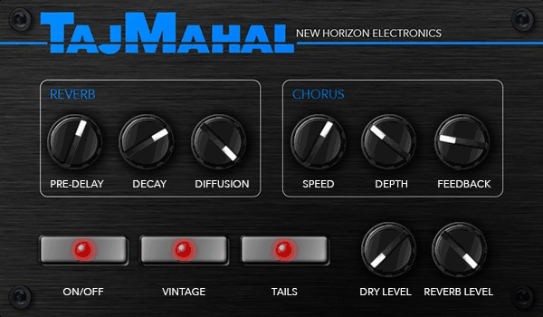

# Taj Mahal

**One preset from 1988. A whole cathedral of chorused air — now on your MOD.**

Taj Mahal by New Horizon Electronics is a big, washy hall reverb for MOD Duo, Duo X and Dwarf. It is modelled on the "Taj Mahal" factory preset of a classic 1988 rack multi-effect: a long, fully diffused hall fed by a slow stereo chorus.



## Why it sounds like that

- **Chorus first, then the hall.** Every note is detuned and spread before it hits the room, so the tail shimmers and swims rather than just decaying.
- **Built-in pre-delay.** 81 ms of air before the room answers, so the dry note stays clear and the bloom arrives behind it.
- **Vintage mode.** The reverb tank is stored at 16-bit precision and the wet signal saturates gently (about 1% at full scale), like the original's converters.
- **Tails.** Bypass can stop feeding the hall and let it ring out naturally, instead of cutting it dead.

## Controls

The knobs use the original hardware's scales, so the factory preset's numbers drop straight in. They are the defaults.

| Control | Range | Default | What it does |
| --- | --- | --- | --- |
| Pre-delay | 0–140 ms | 81 | Gap before the reverb starts |
| Decay | 1–99 | 72 | Reverb length, about 0.5 s to 16 s (72 ≈ 5.5 s) |
| Diffusion | 0–9 | 9 | How smeared the early reflections are; 9 is a smooth wash |
| Speed | 0–99 | 61 | Chorus rate, 0.1–10 Hz (61 ≈ 1.7 Hz) |
| Depth | 0–99 | 31 | Chorus depth, up to ±4 ms |
| Feedback | 0–99 % | 20 | Chorus feedback |
| Dry Level | 0–99 | 0 | Dry signal in the mix (the preset is 100% wet) |
| Reverb Level | 0–99 | 99 | Reverb in the mix; 99 is about unity |
| On/Off | | On | Bypass, handled by the plugin; dry passes at unity |
| Vintage | on/off | On | 16-bit tank and gentle saturation |
| Tails | on/off | On | On: bypass lets the reverb ring out. Off: bypass cuts it |

Mono in, stereo out.

## Install

**Test builds:** upload `mod-plugin-builder/nhe-taj-mahal/nhe-taj-mahal.mk` to <https://builder.mod.audio/buildroot> with your MOD connected over USB, then click Install. Set `NHE_TAJ_MAHAL_VERSION` in that file to the commit you want to build.

**MOD Plugin Store:** not yet. See [docs/release.md](docs/release.md).

**Coming from the cookbook version?** This release has its own identity (URI, bundle and maker), so it installs alongside the earlier `urn:mod-cookbook:taj-mahal` prototype. Pedalboards that use the prototype keep using it until you swap it for this one.

## Build from source

```sh
make                 # builds bin/nhe-taj-mahal.lv2
make install DESTDIR=/path PREFIX=/usr
```

DPF (DISTRHO Plugin Framework) is vendored in `dpf/` at commit `61d38eb638449647fb8395a35c5b8dab7e981ba7`, so no submodules are needed. Cross-compile by setting `CC`, `CXX` and `CXXFLAGS` as usual.

Testing, the pedal-face workflow and the release checklist are in [docs/development.md](docs/development.md).

## Repository layout

| Path | Contents |
| --- | --- |
| `plugins/taj-mahal/` | DSP source (C++, DPF) |
| `bundle/nhe-taj-mahal.lv2/` | LV2 metadata, pedal face (template, CSS, images) |
| `assets/source/` | Source artwork and mockup for the face |
| `mod-plugin-builder/` | Package file for MOD's builder and plugin store |
| `tools/` | Offline LV2 test host, audio test suite, face renderer, knob filmstrip builder |
| `docs/` | Sound design and mappings, development process, release checklist |
| `dpf/` | Vendored DISTRHO Plugin Framework (ISC) |

## Licence

Code: MIT ([LICENSE](LICENSE)). Artwork: © New Horizon Electronics ([ARTWORK-LICENSE.md](ARTWORK-LICENSE.md)). DPF: ISC ([dpf/LICENSE](dpf/LICENSE)).

An independent recreation inspired by a factory preset of a 1988 rack effect. Not affiliated with or endorsed by its maker.
